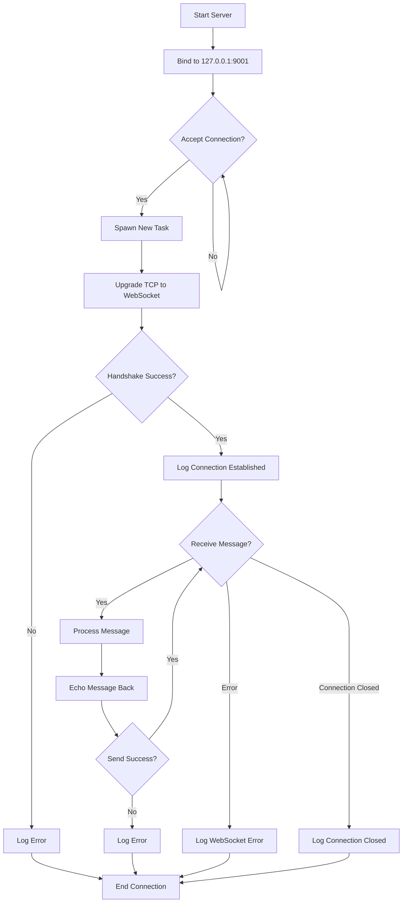

# WebSocket Server Flow Chart

```mermaid
flowchart TD
    A[Start Server] --> B[Bind to 127.0.0.1:9001]
    B --> C{Accept Connection?}
    C -->|Yes| D[Spawn New Task]
    C -->|No| C
    D --> E[Upgrade TCP to WebSocket]
    E --> F{Handshake Success?}
    F -->|No| G[Log Error]
    G --> Z[End Connection]
    F -->|Yes| H[Log Connection Established]
    H --> I{Receive Message?}
    I -->|Yes| J[Process Message]
    J --> K[Echo Message Back]
    K --> L{Send Success?}
    L -->|Yes| I
    L -->|No| M[Log Error]
    M --> Z
    I -->|Error| N[Log WebSocket Error]
    N --> Z
    I -->|Connection Closed| O[Log Connection Closed]
    O --> Z
```

### To create a flowchart,copy-paste the raw text/mermaid code into a mermaid editor:

https://mermaid.live/
